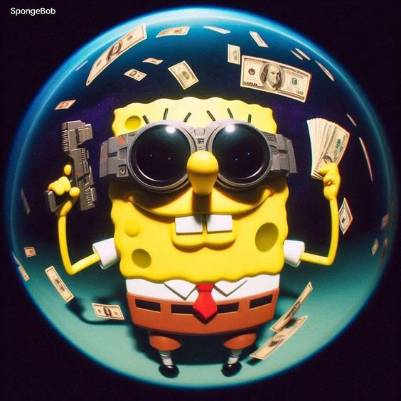

<a name="readme-top">

<br/>

<br />
<div align="center">
  <a href="https://github.com/santuajayvee7">
  <!-- TODO: If you want to add logo or banner you can add it here -->
    
  </a>
<!-- TODO: Change Title to the name of the title of your Project -->
  <h3 align="center">Seatwork 4 - Feature Page</h3>
</div>
<!-- TODO: Make a short description -->
<div align="center">
  Short Description. (Optional)
</div>

<br />

<!-- TODO: Change the zyx-0314 into your github username  -->
<!-- TODO: Change the WD-Template-Project into the same name of your folder -->


---

<br />
<br />

<!-- TODO: If you want to add more layers for your readme -->
<details>
  <summary>Table of Contents</summary>
  <ol>
    <li>
      <a href="#overview">Overview</a>
      <ol>
        <li>
          <a href="#key-components">Key Components</a>
        </li>
        <li>
          <a href="#technology">Technology</a>
        </li>
      </ol>
    </li>
    <li>
      <a href="#rule,-practices-and-principles">Rules, Practices and Principles</a>
    </li>
    <li>
      <a href="#resources">Resources</a>
    </li>
  </ol>
</details>

---

## Overview

<!-- TODO: To be changed -->
<!-- The following are just sample -->
This project showcases the feature of the product

Guiding Question:
- What is the project - This project showcases a dynamic feature section designed to highlight a series of engaging content pieces.
- Whats the purpose - In essence, the purpose is to create a compelling digital environment that effectively promotes and showcases featured content while enhancing user interaction and satisfaction.
- What are key components - HTML Structure & CSS Styling
- What technology used and how it is used - HTML for defining elements such as headers, navigation bars, sections, links, and content containers. CSS for defining styles such as colors, fonts, margins, padding, positioning, and responsiveness. It's used to make elements visually appealing and ensure consistent styling across the site.

### Key Components
<!-- TODO: List of Key Components -->
<!-- The following are just sample -->
- HTML Structure
- CSS Styling
- Multipage Website

### Technology
<!-- TODO: List of Technology Used -->


## Rules, Practices and Principles
1. Always use `WD-` in the front of the Title of the Project for the Subject followed by your custom naming.
2. Do not rename any .html files; always use `index.html` as the filename.
3. Place Files in their respective folders.
4. All file naming are in camel case.
   - Camel case is naming format where there is no white space in separation of each words, the first word is in all lower case while the succeding words first letter are in upper followed by lower cased letters.
   - ex.: buttonAnimatedStyle.css
5. Use only `External CSS`.
6. Renaming of Pages folder names are a must, and relates to what it is doing or data it holding.
7. File Structure to follow below.

```
WD-ProjectName
└─ assets
|   └─ css
|   |   └─ style.css
|   └─ img
|   |   └─ fileWith.jpeg/.jpg/.webp/.png
|   └─ js
|       └─ script.js
└─ pages
|  └─ pageName
|     └─ assets
|     |  └─ css
|     |  |  └─ style.css
|     |  └─ img
|     |  |  └─ fileWith.jpeg/.jpg/.webp/.png
|     |  └─ js
|     |     └─ script.js
|     └─ index.html
└─ index.html
└─ readme.md
```

## Resources

<!-- TODO: Add References -->
| Title | Purpose | Link |
|-|-|-|
| Samsung | Contents of Feature | https://www.gsmarena.com/samsung_galaxy_s24_ultra-12771.php|
| Apple   | Ceontent of Feature | https://www.apple.com/ph/shop/buy-iphone/iphone-15         |
